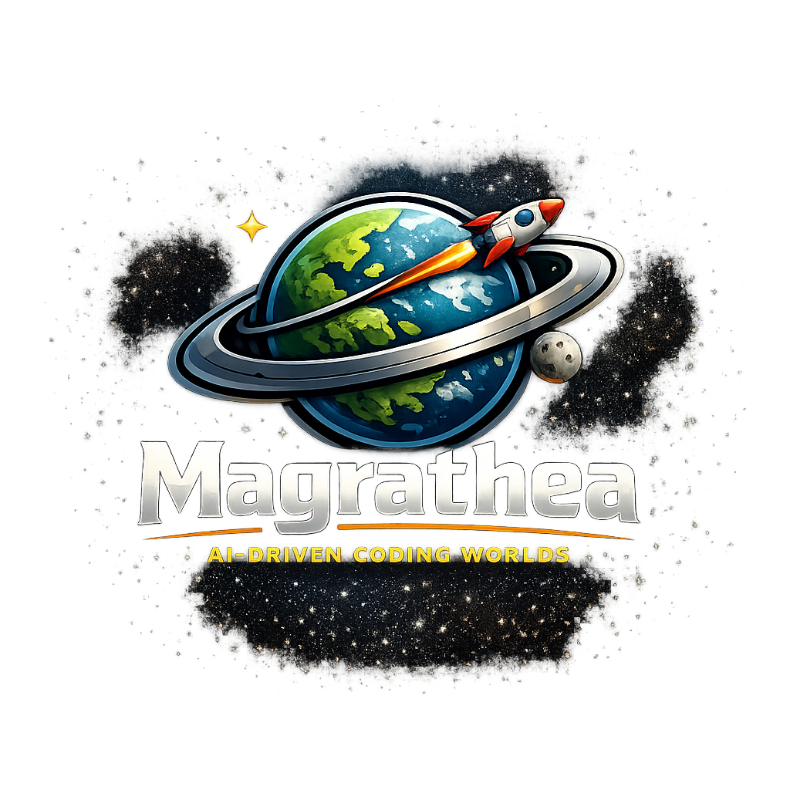

# Magrathea

> *"In those days spirits were brave, the stakes were high, men were real men, women were real women, and small furry creatures from Alpha Centauri were real small furry creatures from Alpha Centauri."* — Douglas Adams, on a previous golden age of software development.

> Build a project-computer that remembers, mostly harmlessly.
>
> Solves 42 problems. Approximately.

A kanban-driven workflow for AI coding agents — turns your project directory into a planet that keeps thinking even after you close the tab.



---

## The Problem It Solves

Every AI coding agent conversation starts fresh. You explain the context, the agent helps, you close the tab. Next day: explain it all again. It's the inverse of Deep Thought — a brilliant machine that re-forgets the question every time you ask it.

Magrathea fixes that. In Douglas Adams' *Hitchhiker's Guide to the Galaxy*, Magrathea is the legendary planet-factory where custom worlds are built to spec. Here, your project becomes the planet under construction — a `magrathea/` directory where every piece of work is its own continent, with planning notes, research, and a "where I left off" file. The accumulated geology of every issue feeds back into `core.md` — the molten core that all future work is built on top of.

Open a new conversation, say "start issue 5", and the agent reads the state, loads the context, and picks up exactly where you stopped. The planet keeps spinning whether you're paying attention or not.

---

## The Kanban Heart

Magrathea is built around a simple board that lives in your filesystem:

```
Todo  →  In Progress  →  In Review  →  Complete
                                          ↓
                                       Closed
```

Every issue is a card on that board. Status moves are explicit — picking up an issue moves it to `In Progress`, finishing moves it to `Complete`, and the board is always queryable with `/board`. The most actionable lane sits closest to your prompt, because you'll want to act on it.

This isn't ceremony. It's the smallest possible system that lets an agent — and you — know what's actually next.

---

## The Prompts

Sticky notes for your desk, except your agent can read them.

### `magrathea`

> "Where am I, and what's going on?"

The orientation command. Reads the README, `core.md`, the board, and the most recent retro, then prints a one-screen briefing: what this project is, what state the planet is in, what's already been decided, and what to do next. Run it when you open a fresh conversation — it costs nothing and saves the "so… where were we?" dance. *The Guide says: Don't panic.*

### `pickup`

> "Hey, let's work on something."

- **With a number**: `pickup 5` or `pickup 005` — resumes that issue, loads its state, moves it to `In Progress`
- **With a name**: `pickup feat-login` — finds it by slug and loads it
- **Alone**: `pickup` — the agent asks if you're resuming something or starting fresh

### `capture`

> "Got an issue. File it before I forget."

The headline use is mid-conversation: you're explaining a bug or sketching a feature, you reach for `/capture`, and the agent files it without making you repeat yourself. Also works as a deliberate planning command — invoke it cold and it asks whether you're filing multiple issues or starting one immediately. In "start working" mode it flows directly into `/pickup`.

### `board`

> "Show me the board."

Renders every issue as a kanban board grouped by status (Closed → Complete → In Review → Todo → In Progress), with the most actionable work closest to your prompt. Complete issues are capped at the 3 most recent to keep the view focused.

### `ask`

> "Hey Magrathea — what do we know about X?"

Query the planet's memory. Reads `core.md` and every retro, then answers with citations. Use it like a favorite mixtape — for the things you keep wanting to refer back to. *"Did we already decide how auth works?"* / *"What did the last retro say about pace?"* / *"Why didn't we use Redis?"* Honest when the planet's memory is silent — won't fabricate.

### `retro`

> "Let's step back and look at the geography."

Reads every issue and previous retro, surfaces patterns and open threads, then facilitates an open conversation — no guided questions, you take it where it needs to go. Action items automatically become tracked issues. Produces a shareable summary for your team or community.

### `board-redraw`

> "Sync the index with reality."

Walks every `state.md` and regenerates `magrathea/board.md` from scratch. Run this on first setup, after a migration, or any time `/board` looks out of sync with what's actually in your issue directories. The other commands will tell you when you need it.

### `magrathea-export`

> "This doesn't belong on this planet. Let's send it somewhere it does."

Packages a single issue into one self-contained, portable Markdown file that another Magrathea instance — a different repo, a different project, even a different organisation — can pick up with zero missing context. It inlines everything the issue depends on (relevant bits of `core.md`, facts borrowed from sibling issues) as plain prose, strips issue numbers, `magrathea/` paths, wikilinks, and personal names, and ships its own "How to Import This" instructions at the bottom of the file — so the document travels alone and still explains itself on arrival. The source issue stays exactly where it was; exporting doesn't close or move it.

### `babelfish`

> "Stick it in your ear. It's a Babel fish — you'll understand, and be understood, in any tongue."

Give it a task — `/babelfish a handover to Ford Prefect about this issue`, `/babelfish email to the researcher about the current process`, `/babelfish a report on the work done on the XSS issue` — and it pulls the recipient, platform, subject, and issue context straight out of that sentence, reads what it needs from the relevant issue, and writes the first draft. Hand it a file or an existing draft instead and it skips straight to the same check every draft gets either way: does every reference in this document actually go somewhere the reader can open? Run it bare — `/babelfish`, no arguments — and it doesn't demand a draft: it asks the naming question once, confirms the guidelines are active, and lets you keep working the issue that's already loaded, applying the same reachability/filing rules to whatever gets written from then on. Asks up front whether real names (yours, colleagues', the company's) should stay in or be genericized to roles — that call depends on who's reading, not on anything the prompt can infer from the draft. It fixes what's local-only: `magrathea/` paths, issue numbers, wikilinks, confirmation-process narration nobody outside needs, and links to private repos the reader can't reach (replaced with an inlined snippet or a flagged attachment). A public-repo reference stays a link. Reads the planet's own tone-guide section in `core.md` if one exists, but doesn't assume any house style of its own. Files the finished correspondence into the working issue's `research/{platform}/` automatically when one is already active, same convention as email records; when nothing's active it drafts anyway and figures out the right issue afterward instead of blocking on it.

---

## What Lives Where

```
your-project/
│
├── magrathea/                       ← the planet
│   ├── readme.md                    ← a playful tour of the directory, for humans browsing
│   ├── core.md                      ← molten core: knowledge shared by every continent
│   │                                  (patterns, decisions, lessons learned)
│   ├── board.md                     ← fast kanban index — what /board reads
│   │
│   └── 001-feat-user-login/         ← one continent per issue
│       ├── planning/                ← design docs, approach notes
│       ├── research/                ← what you investigated and found
│       └── state.md                 ← "where I left off" scratchpad
│
├── prompts/                         ← the prompt files (this repo)
│   ├── magrathea.md
│   ├── pickup.md
│   ├── capture.md
│   ├── board.md
│   ├── board-redraw.md
│   ├── ask.md
│   ├── retro.md
│   ├── magrathea-export.md
│   └── babelfish.md
│
└── templates/                       ← starter files copied into magrathea/ on install
    ├── readme.md                    ← copied as magrathea/readme.md
    ├── board.md                     ← copied as magrathea/board.md
    ├── core.md                      ← copied as magrathea/core.md
    └── state.md                     ← copied as magrathea/example-state.md (reference shape only)
```

Where you install the prompts depends on your agent — see [Installation](#installation) below.

---

## A Day in the Life

**Monday morning — you want to add a dark mode toggle:**

```
You:    /capture
Agent:  What does this issue need to accomplish?
You:    Add a dark mode toggle to the header
Agent:  Title: "Dark Mode Toggle" — slug: feat-dark-mode-toggle. Good?
You:    yes
Agent:  ✓ Created issue: 007-feat-dark-mode-toggle. What would you like to do first?
You:    Let's plan it out
Agent:  [writes a plan to magrathea/007-feat-dark-mode-toggle/planning/approach.md]
```

**You get pulled into meetings. Come back Tuesday:**

```
You:    /pickup 7
Agent:  Resuming 007-feat-dark-mode-toggle.
        Status: In Progress
        Last focus: planning the toggle implementation.
        Progress: approach.md written, CSS variables identified.
        What would you like to do?
You:    Let's write the code
```

No re-explaining. No "so last time we were...". Just work.

**When the issue is done:**

The agent moves the card to `Complete` and updates `magrathea/core.md` with anything useful for future issues — patterns discovered, decisions made, gotchas to avoid. That knowledge becomes part of the planet forever.

---

## Installation

### Supported agents

| Agent | Guide |
|-------|-------|
| Claude Code | [install/claude-code.md](install/claude-code.md) |
| OpenCode | [install/opencode.md](install/opencode.md) |
| Zed | [install/zed.md](install/zed.md) |

### Quick start (Claude Code or OpenCode)

1. **Copy the prompts** into your agent's commands folder:

   ```bash
   # Claude Code
   mkdir -p .claude/commands && cp prompts/*.md .claude/commands/

   # OpenCode
   mkdir -p .opencode/commands && cp prompts/*.md .opencode/commands/
   ```

2. **Create the planet** at your project root by copying the four starter templates that ship with this repo:

   ```bash
   mkdir magrathea
   cp templates/readme.md  magrathea/readme.md
   cp templates/board.md   magrathea/board.md
   cp templates/core.md    magrathea/core.md
   cp templates/state.md   magrathea/example-state.md
   ```

   - `readme.md` — a playful tour of the directory for humans browsing the project. Not load-bearing, just polite.
   - `board.md` — the empty kanban index. `/board` reads it; `/board-redraw` rewrites it.
   - `core.md` — the molten core, pre-stubbed with the section headings (`Decisions`, `Patterns`, `Constraints`, `Lessons Learned`, `Glossary`) that the prompts and `/ask` already know how to navigate.
   - `example-state.md` — a populated reference showing what a healthy `state.md` looks like once work is underway. Copy it into `magrathea/` so humans and agents can see the canonical shape without leaving the planet. `/board-redraw` ignores it (regex matches `^\d{3}-` only).

3. **That's it.** Start your agent and invoke `/pickup` to start, or `/capture` to file a new issue.

### Upgrading from the old `project/` layout

If you were running an earlier version of this workflow (with `project/` and `information.md`), copy `prompts/migrate.md` into your commands folder and run `/migrate` once. It renames the folder and file, refreshes your installed prompts, and reports what it did. Delete `migrate.md` afterwards — it's a one-off.

---

## Tips

- **Don't panic — but do confirm.** When you describe a task, the agent researches the code, writes a structured plan listing every file it intends to touch, and waits for your explicit "yes" or "go ahead". Describing a task — or it being small and obvious — is not approval. No exceptions.
- **The board is the truth.** Status (`Todo`, `In Progress`, `In Review`, `Complete`, `Closed`) is how cards move. Moving status is a deliberate act, not a side effect. `/board` shows you the board at any time.
- **Titles are editable, slugs are not.** The H1 in `state.md` is the human-readable title and can evolve as the issue does. The `**Issue**` field is the permanent slug reference — never change it. The Vogons don't tolerate revisionism.
- **Progress Log is permanent.** It only ever gets appended to — the agent should never erase earlier entries when closing an issue. The geology of the planet is a record, not a draft. Marvin would approve, if Marvin approved of anything.
- **Update `state.md` often.** At the end of a session, ask your agent: *"Update the state with what we did today."* Your future self will thank you.
- **`core.md` is gold.** When closing an issue, ask: *"What should we add to core.md from this work?"* The molten core feeds every future continent — and powers `/ask`. The quality of `/ask` is the quality of `core.md`.
- **Issue numbers are for humans.** `issue 3` is easier to type than `issue 003-feat-dark-mode-toggle`. Both work.
- **Keep issues focused.** One clear goal per continent. If scope creeps, create a new issue and link them in `state.md`.
- **You control the workflow.** These are markdown files — read them, edit them, adapt them to your team's needs. Magrathea is a planet you can re-terraform.

---

## Adapting for Your Project

The prompts are fully generic. The only project-specific thing is your agent's context file (e.g., `CLAUDE.md` for Claude Code, `AGENTS.md` for OpenCode, `.zed/rules.md` for Zed) — that's where you describe your tech stack, environment, and development conventions. See your agent's documentation for how to set this up.

**Tell your agent where the knowledge lives.** The whole point of Magrathea is that project knowledge lives in the project itself — but the agent has to know to look there. Each install guide has a recommended snippet to drop into your context file (`CLAUDE.md`, `AGENTS.md`, etc.) that points the agent at `magrathea/core.md`, `magrathea/board.md`, and the issue directories. Copy it in once; everything afterward is easier.

The `magrathea/core.md` file is where accumulated project knowledge lives. The starter template stubs out the section headings (`Decisions`, `Patterns`, `Constraints`, `Lessons Learned`, `Glossary`) — fill them in as issues close.

---

*Built with love during the Hyva Developers Paradise workshop. Shared because good workflows should travel. So long, and thanks for all the context.*
